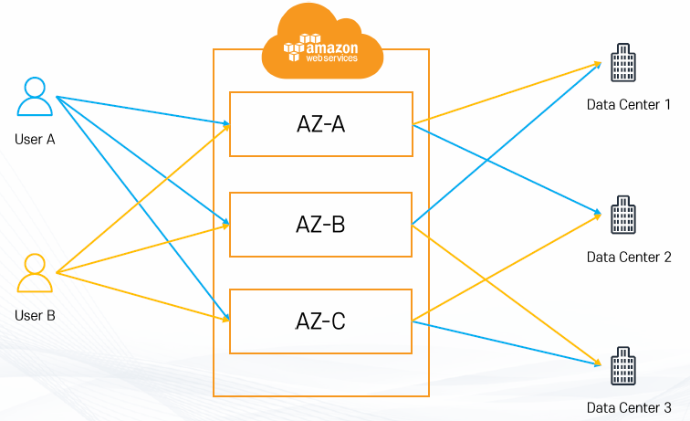
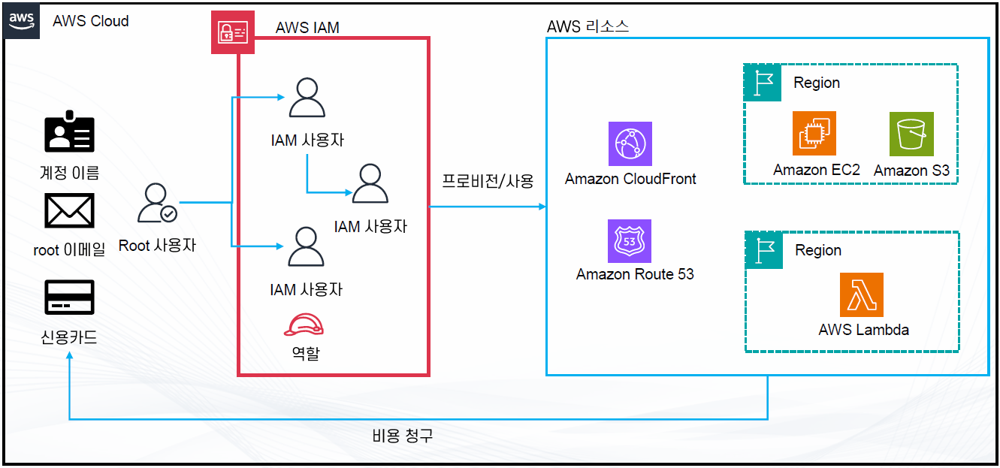

### AWS의 구조

#### 리전(region)
- AWS의 서비스가 제공되는 서버의 물리적 위치
- 전 세계에 흩어져 있으며 큰 구분(동남아, 유럽, 북아메리카 등)으로 묶여 있음
- 각 리전에는 고유의 코드가 부여 됨
  - 서울 리전은 ap-northeast-2
  - 미국 동부(버즈니아 북부) 리전은 us-east-1
- 리전별로 가능한 서비스가 다름

- 리전을 선택할 때 고려할 점
  - 지연 속도
  - 법률(데이터, 서비스 제공 관련)
  - 사용 가능한 AWS 서비스

- us-east-1 리전
  - 모든 AWS의 서비스가 최초로 서비스되는 리전
  - 기타 글로벌 서비스의 서비스 리전
    - 예)빌링, CloudFront 등

#### 가용 영역(Avaliability Zone)
- 가용 영역이란
  - 리전의 하부 단위
    - 하나의 리전은 3개 이상의 가용영역으로 구성
    - AZ라고 줄여서 부른다.

- 가용 영역의 구성
  - 하나 이상의 데이터 센터로 구성
  - AZ간의 연결은 매우 빠른 전용 네트워크로 연결
  - 반드시 물리적으로 일정 거리(몇 KM 이상) 떨어져 있음
    - 다만 모든 AZ는 서로 100KM 이내의 거리에 위치
    - 여러 재해에 대한 대비 및 보안

- 가용 영역의 위치
  - 각 계정별로 AZ의 코드와 실제 위치는 다름
    
    - 예) 계정 Test1의 AZ-A는 계정 Test2의 AZ-A와 다른 위치(랜덤)
    - 보안 및 한 AZ로 몰림을 방지

#### 엣지 로케이션(Edge Location)
- AWS의 CloudFront(CDN) 등의 여러 서비스들을 가장 빠른 속도로 제공(캐싱)하기 위한 거점
- Global Accelerator와 유저를 연결하는 거점
- 전 세계에 여러 장소에 흩어져 있음

#### 글로벌 서비스와 리전 서비스
- 서비스의 종류
  - AWS에는 서비스가 제공되는 지역의 기반에 따라 글로벌 서비스와 리전 서비스로 분류

- 글로벌 서비스
  - 데이터 및 서비스를 전 세계의 모든 인프라가 공유
  - 예) IAM, Route53, WAF

- 지역 서비스
  - 특정 리전을 기반으로 데이터 및 서비스를 제공
  - 예) 대부분의 서비스
    - 리전 전체의 가용 영역에서 서비스 or 리전의 하나의 가용 영역에서만 서비스

- AWS 서비스의 위치
  - 리전
    - 리전 전체의 가용 영역에서 서비스
    - 리전의 하나의 가용 영역에서만 서비스
  - 글로벌

#### ARN(Amazon Resource Names)
- ARN이란?
  - AWS의 리소스에 부여되는 고유 아이디

- 형식
  - "arn:[partition]:[service]:[region]:[account_id]:[resource_type]/resource_name/(qualifier)"
  - 예) arn:aws:dynamodb:ap-northeast-2:123456789012:table/mytable

#### AWS 구성
- AWS는 여러 리전과 리전 안의 3개 이상의 가용영역, 엣지 로케이션으로 구성
- 리전: AWS가 제공되는 서버의 물리적 위치
- 가용영역 : 하나의 리전 안에 세 개 이상의 가용 영역이 있으며 하나 이상의 데이터 센터로 구성
- 엣지 로케이션 : AWS의 여러 서비스를 빠르게 제공하기 위한 거점(캐싱)
- AWS의 서비스는 글로벌 서비스와 리전 서비스로 구성
- AWS의 모든 리소스는 ARN이 부여됨

### AWS 계정(Account)

- AWS의 사용자와 리소스를 관리하는 단위
  - AWS 계정에 AWS 리소스를 생성
  - 이후 다양한 사용 주체(IAM 사용자, 역할 등)이 생성된 리소스를 사용
  - 계정 != 사용자

- 계정의 생성 방법
  - 이메일, 신용카드, 계정 이름을 제공해서 신규 계정 생성
  - AWS Organization으로 구성

- 계정 생성 시 Root 사용자 자동으로 생성

#### Root 사용자
- 계정을 생성할 때 같이 생성되는 사용자
- 계정의 모든 권한을 가지고 있으며 계정 권한을 제한할 방법이 없음
  - 탈취 당했을 때 복구가 매우 어려움 = MFA 필수

- Root 사용자만 가능한 작업
  - AWS 계정 설정 변경(메인 이메일 주소, 계정 이름, 연락처 정보 등)
  - 요금 관련 설정(IAM 유저에게 위임 가능)
  - AWS Support Plan(지원 플랜) 구독, 변경, 취소
  - AWS 계정 삭제

### IAM 사용자
- IAM(Identity and Access Management)을 통해 생성한 사용자
- 생성 시 권한이 따로 부여되어 있지 않으며 정책 혹은 그룹을 통해 권한을 부여받아 활동

#### AWS 계정(Account)의 의미
- AWS 리소스 관리의 일반적인 최대 단위
  - 일반적으로 설정의 가장 큰 단위는 계정
  - 예)계정 별 최대 S3 최대 버킷 개수 등

- 관리/피해 범위를 한정할 수 있음
  - 권한 관리를 쉽게할 수 있음
  - 해킹 등의 피해 발생 시 피해 범위 최소화 가능

- 비용 범위에 대한 확인을 쉽게할 수 있음