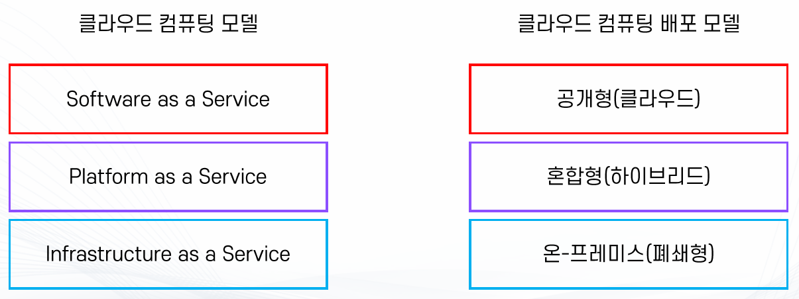
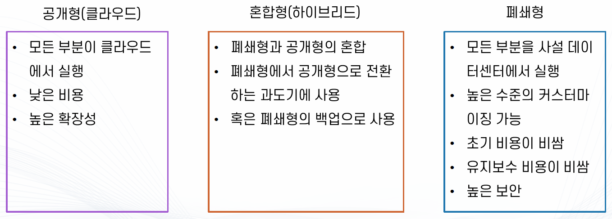

### 클라우드 컴퓨팅이란
>💡클라우드 컴퓨팅은 IT 리소스를 인터넷을 통해 **온디맨드**(수요에 반응)로 제공하고 **사용한 만큼만 비용을 지불하는 것**을 말한다.

- 데이터센터 : 애플리케이션의 서버를 호스팅하는 실제 시설
  - 운영에 비용이 많이 소요됨 (건물 유지비용, 서버 구매비용, 셋업, 유지보수 등)
  - 한번 구매하면 수요에 상관없이 계속 보유해야 함
  - 느린 구축 시간
    - 유저의 수요에 빠르게 대처하기 힘듬
    - 장애 기기를 교체하는 시간 역시 느림

- 클라우드
  - 자본지출(CAPEX)을 운영지출(OPEX)으로 대체
    - 데이터 센터 구축 비용, 서버 구매 비용 => 운영비
    - 막대한 초기 비용 대신 쓰는 만큼 비용 지불
  - 규모의 경제로 얻게 되는 이점
    - 한 개를 사는 것 보다 100개를 사는게 단가가 낮음 => 규모의 경제
    - AWS의 규모의 경제로 인한 이득을 누릴 수 있음
  - 용량 추정 불필요
  - 속도 및 민첩성 개선
    - 몇 번의 클릭으로 바로 리소스 확보 가능
    - 개발 비용 절감
  - 데이터 센터 운영 및 유지 관리에 비용 투자 불필요
    - 인프라 관리가 아닌 비즈니스에 자원 집중 가능
  - 빠른 확장성
  
### 클라우드 컴퓨팅 모델

- IaaS: Infrastructure as a Service
  - 인프라만 제공
  - OS를 직접 설치하고 필요한 소프트웨어를 개발해서 사용
  - 가상의 컴퓨터를 하나 임대하는 것과 비슷함
  - 예) Amazon EC2
- PaaS: Platform as a Service
  - 인프라 + OS + 기타 프로그램 실행에 필요한 부분(런타임)
  - 바로 코드만 올려서 돌릴 수 있도록 구성
  - 예) Firebase, Google App Engine, AWS Lambda, RDS 등
- SaaS: Software as a Service
  - 서비스 자체를 제공
  - 다른 세팅 없이 서비스만 이용
  - Gmail, Slack
- 배포 모델

### 클라우드 용어
- 고가용성(High Availability)
  - 장애 상황을 해결하고 서비스를 지속할 수 있는 능력
  - 장애 상황의 준비가 되어있는 아키텍처 필요
  
- 장애 내구성 or 내결함성(Fault Tolerance)
  - 장애 상황에도 서비스를 지속할 수 있는 능력
  - 장애 상황에 영향을 받지 않는 아키텍처가 필요
  
- 장애 내구성 확보
  - 일반적으로 완전한 장애 내구성 위해서는 한 개 이상의 예비 인프라가 필요
    - 비용 증가
  - 이외에 두 개 이상의 인프라를 활용하기 위한 추가적인 아키텍처가 필요
    - 복잡함 증가
  - 따라서 고가용성/장애 내구성 중 어떤 것을 확보할지 고민이 필요함
  
- 재해 복구(Disaster Recovery)
  - 말 그대로 장애 상황을 복구하는 것
  
- 확장성(Scalable) : 쉽고 빠르게 규모를 늘릴 수 있는 능력
  - 주로 수요에 따라 컴퓨팅 파워 혹은 용량 확장
  
- 탄력성(Elastic) : 수요에 따라 컴퓨팅 파워/용량을 확장하거나 축소할 수 있는 능력
  - 불필요한 자원을 사용하지 않고 비용 최적화에 필수적인 능력
  
- 긴밀한 결합(Tight Coupling)
  - 다른 주체에 대해서 단단하게 얽힌 상태
  - 주체끼리 높은 의존성을 가지고 있어 변경하기 쉽지 않음
  
- 느슨한 결합(Loose Coupling)
  - 다른 요소에 대해 얽히지 않고 연결되어 있는 상태
  - 주체끼리 낮은 의존성을 가지고 있어 쉽게 변경할 수 있고 유연함

- 가상화
  - 단일 컴퓨터의 하드웨어 요소를 일반적으로 가상 머신(VM)이라고 하는 다수의 가상 컴퓨터로 분할 할 수 있도록 해주는 기술
  
- 온프레미스(On-premise) : 자체적으로 데이터센터 혹은 전산실에 서버를 설치해 운영하는 방식
  - 클라우드 서비스의 반대 개념

- 프로비전 : 리소스를 사용할 수 있도록 준비
  - EC2, AWS 서비스 등을 사용하기 위해 준비하는 것을 의미

### 가상화
- 배경지식
  - 운영체제(Operating System, OS) : 시스템 하드웨어 자원과 소프트웨어 자원을 운영 관리하는 프로그램
    - Window, Linux, MacOS, Android, ...
  
  - 특권 명령(privileged instruction) : 시스템 요소들과 소통할 수 있는 명령 - OS(Kernel)만 가능, 운영체제나 하드웨어 자원에 직접 접근할 수 있는 고급 명령어를 의미한다. CPU가 커널 모드에서만 실행할 수 있는 명령어로 시스템 자원에 직접 영향을 미치는 작업을 수행한다.
    - OS는 특권 명령 때문에 하나의 하드웨어 시스템 당 하나밖에 돌아갈 수 없음.
    - 일반 프로그램은 특권 명령이 필요 없기 때문에 많은 프로그램을 동시에 수행 가능

  - 가상화가 나타나기 전 까지는 하나의 하드웨어 시스템은 하나의 OS만 실행이 가능했음
    - 즉 일반적인 컴퓨터처럼 직접 OS가 하드웨어에 설치된 상태(Bare-Metal)로만 운영 가능했었음