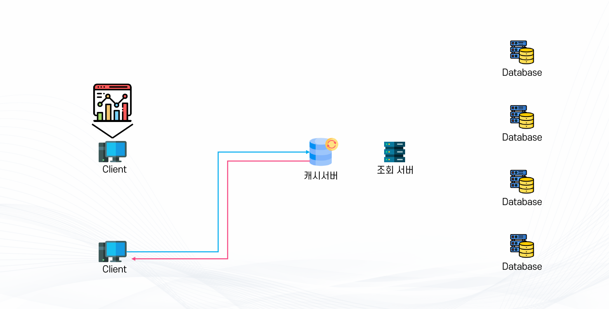
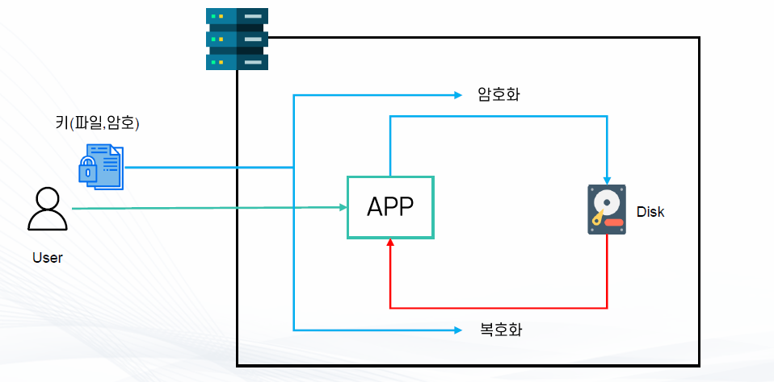
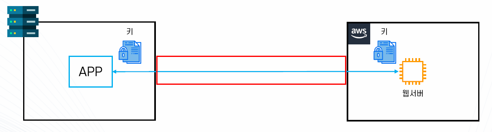
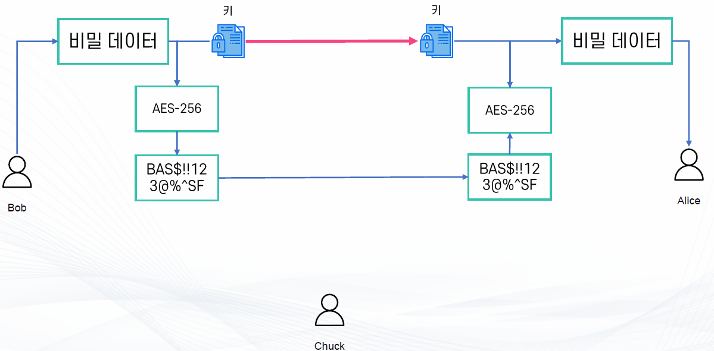
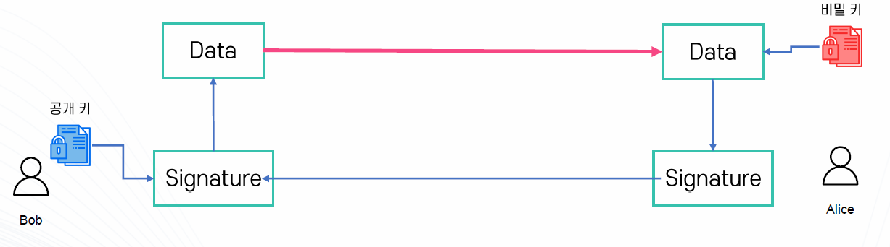
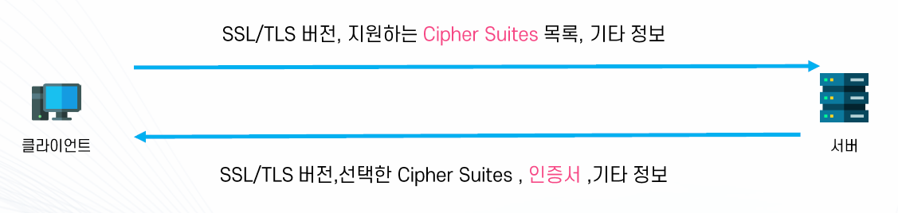
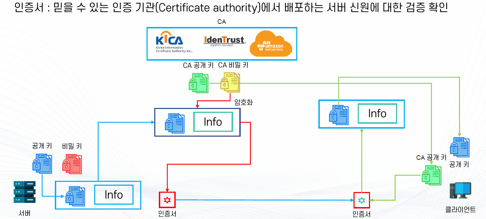
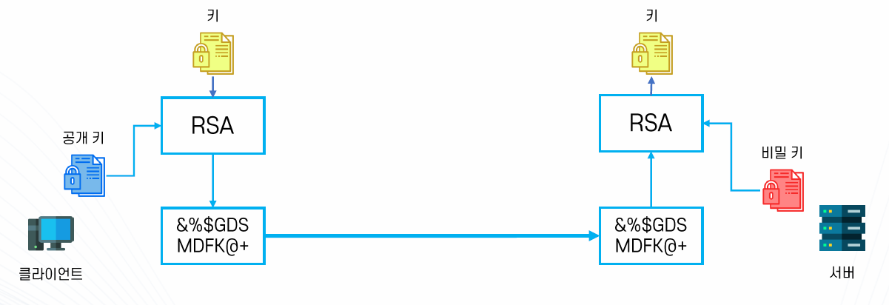
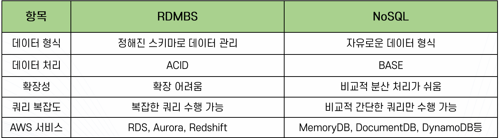

### DNS
#### 주요 개념
- DNS(Domain Name System) : 사람이 읽을 수 있는 문자열과 Internet 프로토콜 기반 정보를 매칭시켜주는 시스템
  - Internet Corporation for Assigned and Numbers (ICANN)에서 관리
- 도메인(Domain) : 대상의 IP주소 등의 정보와 맵핑되는 사람이 알아볼 수 있는 문자열
  - 서브도메인 : 도메인 중 문자열 앞에 추가 문자열이 붇는 도메인
    - 예) text.example.com
  - APEX 도메인(Zone Apex, Root Domain ...) : 도메인 중 앞에 추가 문자열이 없는 순수한 최상위 도메인
    - 예) example.com
- 레코드(DNS Record) : 도메인이 어떤 방식으로 데이터와 매칭되는지 정의하는 기록
  - 다양한 레코드 종류가 있으며 각 각 다른 정보와 매칭
  - 예: A레코드는 IPv4 주소, MX 레코드는 메일서버
- Domain Zone : 도메인의 정보를 담은 레코드의 집합
  - 예: www.awsclassroom.kr / lecture.awsclassroom.kr 등등
- Zone File : Domain Zone 정보를 저장한 텍스트 파일
- DNS Query : 주어진 도메인에 해당하는 정보를 요청하는 쿼리
- Name Server(NS) : DNS Query를 Zone File을 기반으로 응답할 수 있는 서버
  - Authoritative : DNS 정보의 원본을 가지고 있는 가장 최상위 NS 서버
  - None-Authoritative : Authoritative NS 서버를 조회하여 정보를 보관하고 있거나 응답하는 서버(캐시)
- DNS Resolver : 사용자와 NS 서버 사이에 위치한 서버로 실제 유저의 요청에 따라 IP주소 등의 정보를 확보하는 서버
  - 유저의 클라이언트가 제일 먼저 쿼리를 요청하는 대상이며 보통 ISP가 관리

#### 구성
- DNS는 계층 구조
  - 최상위 도메인부터 차례대로 계층 구조로 구성되어 있음(도메인의 개수가 많기 때문에 트레픽을 분산시킴)
  - 실제 레코드는 가장 마지막 계층에서 보관 및 처리

- DNS Root
  - DNS 계층 구조의 최상위 레벨
    - 즉 DNS Query 수행 시 최초로 조회하는 거점
    - 다음 단계인 TLDs(Top Level Domain)의 Zone File을 가진 NS 서버의 주소 정보 공유
  - IANA(Internet Assigned Numbers Authority)에서 조율하는 13개의 주체에서 관리
    - A~M까지 각 관리 주체별로 다른 서버 주소
  - Root Hints File
    - DNS Root의 주소를 담은 파일
    - 각 DNS Resolver에 하드코딩

- Top Level Domains(TLDs)
  - DNS 계층 구조의 두 번째 레벨
    - 실질적으로 정보를 가지고 있는 최상위 레벨
    - 예).com/.org/.net/.info 등등
  - 종류
    - Country Code TLDs : 각 나라에 할당된 두 자리 코드
      - 예).kr/.jp/.uk/.ai
    - Sponsored TLDs : 사설 조직이나 기관에 할당된 TLDs
      - 예).edu/.gov/.mil 등등
    - New Generic TLDs : 기타 다양한 TLDs
      - 예).app/.tech/.xyz/.blog
    - 관리 주체 : TLDs Registry (각 회사/나라 등)
      - 예).com/.net -> Versign, .org->Public Interest Registry, .kr->Korea Internet & Security Agency (KISA)
    - 실제 도메인의 레코드를 관리하는 NS서버의 주소 정보를 담은 Zone File 보유
  
- NS(Name Server)
  - 실제 도메인의 레코드를 가지고 있는 서버
    - 이 NS의 주소를 TLDs에 등록해두면 클라이언트에서 DNS 쿼리에 따라 해당 NS로 도착
  - 해당 도메인 및 서브도메인들이 어떤 프로토콜의 어떤 주소로 맵핑되는지(레코드)에 관한 Zone File보유
  - 여기서 최종으로 맵핑된 주소 확보

#### DNS를 통해 IP를 찾는 과정

1. 클라이언트(OS의 Stub Resolver)가 DNS Resolver(Recursive Resolver로 ISP나 Google DNS 같은 외부 DNS 서버)에 요청을 하면 DNS Resolver는 Hints File을 통해 DNS Root로 요청하면 DNS Root는 .kr(TLDs)에 대한 주소를 리턴한다.

2. DNS Root로부터 받은 정보를 통해 TLDs로 요청내면 TLDs에 저장된 NS의 정보를 리턴한다.

3. NS에서 Zone File에 등록된 정보를 통해 최종 도메인의 주소 정보를 리턴한다.

#### 도메인 등록

- 도메인 등록 대행(Domain Registrar)을 통해 등록
  - 도메인 등록 대행(Domain Registrar) : ICANN에게 인증받고 TLDs Registry와 협의하여 도메인 등록의 권한을 가진 주체
  - 예: 가비아, GoDaddy, Cafe24, AWS Route 53등
- 등록할 때 TLDs Registry에 자신이 원하는 NS 주소를 등록
  - 일종의 남은 슬롯에 자신의 NS를 예치하는 개념
  - NS는 자신의 개인 NS를 사용하거나, DNS Hosting Service 업체에서 대여 가능
  - DNS Hosting Service : DNS 기능을 제공하는 주체
    - 예 : 가비아, AWS Route53
    - 거의 대부분의 Registrar는 DNS Hosting Service를 같이 제공

### 캐싱(Caching)

- 데이터의 복제본 혹은 연산 결과를 임시로 저장하여 요청의 응답을 효율적으로 하는 기술
  - 자주 사용되는 복잡한 연산의 결과 혹은 자주 찾는 데이터를 효율적으로 전달하는 것이 목적
- 장점
  - 요청에 따라 빠르게 데이터를 전달할 수 있음
  - 복잡한 연산 리소스 / 부하를 줄일 수 있음
- 단점
  - 일관성의 유지가 어려움
  - 아키텍처의 복잡도 증가
  - 비용 증가 (하지만 그만큼 연산이 줄어든다.)

#### 주요 개념
- 원본 : 캐싱할 데이터 혹은 연산 결과를 제공하는 주체
- Cache Hit : 요청에 따라 캐시에 저장된 데이터로 응답할 수 있는 상황
  - 캐싱에서 지향할 상황이며 원본에 요청 없이 응답 가능
- Cache Miss : 요청에 따른 데이터를 캐시에서 찾을 수 없는 상황
  - 별도로 원본에 요청 혹은 다른 방식으로 응답 필요
- 캐시 만료(Invalidation/Eviction) : 캐시를 삭제하는 행위
  - TTL(Time To Live) : 캐시가 얼마만큼 살아있는지를 나타내는 시간 단위

#### 캐시 방식
- 캐시에 원본 데이터를 채우는 다양한 정책
  - Lazy Loading : 요청이 있을 때만 캐시에 원본데이터를 채우는 정책
    - 불필요한 요청이 없으나 최초 데이터 로딩이 필요함
  - Eager Loading : 미리 캐시에 데이터를 채워두고 요청을 기다리는 정책
    - 데이터가 항상 준비되어 있으나 모든 데이터를 채우기에 불필요한 캐시 용량이 낭비될 수 있고 최초 로딩이 매우 큰 리소스가 필요함
  - Write Through : 데이터가 변경되거나 저장되는 시점에 원본과 캐시에 동시에 저장
    - 데이터의 일관성이 항상 보장되지만 쓰기 과정이 복잡해지고 느려질 수 있음
  - Write Back : 데이터를 캐시에 먼저 쓰고 후에 원본에 업데이트
    - 쓰기가 빠르고 간단하지만 원본에 도달 전 유실 될 가능성이 있음

#### 캐시 만료 방식
- TTL(Time to Live) : 일정 시간이 지나면 만료
  - 항상 일정 시간 후 데이터가 만료되고 갱신할 수 있으나 모든 데이터를 항상 갱신 필요
- Least Recently Used : 가장 사용 시점이 먼 캐싱 데이터부터 만료
  - 사용이 발생한 데이터들을 계속 보관할 수 있으나 상황에 따라 비효율적일 수 있음
- Least Frequently Used : 가장 덜 사용된 데이터부터 만료
  - 자주 사용된 데이터를 남겨둘 수 있으나 현재 자주 사용되지 않는 데이터도 같이 남겨둘 수 있음
- First In First Out : 먼저 들어온 데이터부터 만료
  - 간단하지만 패턴을 고려하지 않아 비효율적

#### 사용 사례
- Content Delivery Network(CDN)
- ElastiCache (Redis/Memcached)
  - 랭킹, 세션 데이터 등
- 웹 브라우저
- RAM
- DNS

### 암호화 및 SSL/TLS

#### 암호화
- 수학적인 과정으로 어떤 정보를 읽을 수 없는 데이터로 변환하는 행위
  - 복원이 가능 <-> Hash는 복원이 불가능
- 암호화의 종류
  - 암호화 기술을 사용하는 상황에 따라
    - 저장된 데이터 보호(Encryption At Rest)
    - 전송 중 데이터 보호(Encryption At Transit)
  - 암호화 방법에 따라
    - 대칭키 암호화
    - 비대칭키 암호화
- 암호화 용어
  - 평문(Plaintext) : 암호화 하기 전의 데이터
  - 암호문(Ciphertext) : 평문을 암호 키와 알고리즘을 사용해 암호화 한 데이터
  - 암호화(Encryption) : 평문에 암호화 알고리즘과 키를 적용하여 키를 소유한 주체가 아니면 알아볼 수 없는 암호문으로 만드는 과정
  - 복호화(Decryption) : 암호문에 키와 복호화 알고리즘을 적용하여 평문으로 되돌리는 과정
  - 키(Key) : 평문을 암호화하거나 암호문을 평문으로 돌리기 위한 알고리즘에 핵심 가변정보 값
  - 암호 알고리즘 : 암호화/복호화를 위해 사용되는 알고리즘
    - AES, DES 등

#### 저장된 데이터 보호(Encryption At Rest)

- 데이터를 저장할 때 암호화하고 필요할 때 복호화해서 사용하는 방식
- 주로 하나의 물리적인 기기에 보안을 적용하기 위해 사용
  - 예) 기기를 탈취당했을 때 데이터의 보호
- 주로 키 파일 혹은 암호를 사용하여 암호화/복호화

#### 전송 중 데이터 보호(Encryption At Transit)

- 데이터의 전송 중 암호화를 적용하여 데이터가 탈취 당하지 않도록 보호
- 주로 여러 시스템/기기 간에 보안을 적용하기 위해 사용
  - 예) SSH/TLS, HTTPS 등

#### 대칭키 암호화(Symmetric Encryption)

- 하나의 키로 암호화, 복호화를 하는 알고리즘
- 연산이 빠름
- 키를 전달하는 과정에서 탈취 당할 수 있기 때문에 전달 방법에 대한 고민이 필요함

#### 비대칭키 암호화(Asymmetric Encryption)
- 한 쌍의 키를 활용한 암호화, 단 하나의 암호는 암호화만 가능하며, 다른 하나는 복호화만 가능
- 연산이 비교적 복잡하지만 키 전달이 쉬움
- 공개 키/비밀 키 : 각 각 암호화 복호화만 할 수 있는 키쌍
  - 예) 공개키로 암호화하면 비밀키로 복호화 가능
  - 예) 비밀키로 암호화하면 공개키로 복호화 가능

#### 암호화 서명(Signing)

- 키를 사용해서 데이터의 생성자가 데이터를 생성했음을 보장하는 방법
  - Private 키를 사용하여 Public 키로 검증 가능한 데이터의 서명(Signature)을 생성
  - Private 키를 가진 주체가 데이터를 생성했음을 보장할 수 있는 방법

#### SSL/TLS
- 클라이언트와 서버간에 데이터 무결성과 기밀성을 보장할 수 있는 프로토콜
  - 상호간의 통신은 암호화 되어 전달되며 중간에서 데이터를 탈취당해도 안전함
- HTTPS 등 다양한 프로토콜에 활용
  - 일반 HTTP의 경우 연결이 안전하지 않기 때문에 보안적으로 취약함
- 3단계 과정 (Handshake)
- TLS는 SSL의 후속 버전이며 현재는 TLS가 표준이다.

#### Cipher Suites 교환

- TLS에서 활용하는 보안 알고리즘들

#### 인증

- 서버와 클라이언트 간 통신을 할 때 **서버가 신뢰할 수 있는 서버라는 것을 확인**하는 작업이 필요한데 이 때 사용하는 것이 **인증서**이다.
- 인증서에는 서비스 정보(인증서를 발급한 CA, 서비스의 도메인 등), 서버 측 공개키(공개키, 공개키 암호화 방법), 지문, 디지털 서명 등의 정보가 포함되어 있다.
- CA는 인증서를 발급해주는 기관으로, Root Certificate라고 부르기도 하며 자체적으로 공개키와 비밀키를 갖고 있다. Self-Signed(스스로 보증)이라고 하며 자신의 인증서를 해시한 후 CA가 아닌 자신의 비밀키로 암호화하여 서명으로 등록한 것을 말한다.

1. 서버(기관)측에서 CA 인증 기관에 도메인, 공개 키 등을 제출한다.
2. CA는 검증 후 발급 받고자 하는 서버(기관)의 공개 키를 해시한다. 이렇게 해시 한 값을 Finger Print(지문)이라고 한다.
3. 이 지문을 CA의 비밀 키로 암호화하고 인증서의 발급자 서명으로 등록 한다. 이렇게 서명 된 것을 디지털 서명(Digital Signing)이라고 하며 CA는 서버에게 이 디지털 서명, 발급자 정보 등이 등록되어 있는 인증서를 발급해 준다. (이러한 방식처럼 상위 인증 기관이 하위 인증서가 포함하고 있는 공개키 (인증서)를 상위 기관의 비밀키로 암호화하여 상호 보증하게 되는 것을 인증서 체인(Certificate Chain)이라고 한다.)
4. 이렇게 발급 받은 인증서를 클라이언트에서 요청이 오면, 클라이언트에 전송한다.
- 클라이언트가 HTTPS 요청을 보내면 서버는 자신의 디지털 인증서를 응답에 포함시켜 보낸다.
- 이 인증서는 일반적으로 X.509 형식이며, 다음과 같은 정보를 포함한다.
  - 서버의 도메인 이름
  - 서버의 공개키
  - 인증서 발급자(CA)
  - 유효 기간
  - 디지털 서명
5. 클라이언트는 서버로부터 인증서를 받으면 해당 인증서의 서명을 검증한다.
- 인증서에는 CA(인증 기관)가 서명한 디지털 서명이 포함되어 있다.
- 클라이언트는 이 서명을 검증하기 위해 자신이 신뢰하는 루트 인증서 목록에서 해당 CA의 공개키를 찾는다. (이 목록은 브라우저나 OS에 사전 설치된 루트 인증서 저장소에 있다.)
- 인증서 체인 검증
- 도메인 이름 일치 확인
- 유효한 인증서인지 확인
6. 검증 된 인증서에는 서버가 보낸 정보와 공개키가 들어있기 때문에 클라이언트는 서버를 신뢰할 수 있다.
7. 이렇게 얻은 공개키를 기반으로 서버와 통신을 한다.

### RDBMS vs NoSQL

#### RDBMS
- Relational Database Management System : 데이터의 관계에 집중하여 정형화된 형식으로 데이터를 관리하는 DB 관리 시스템
  - 행과 열로 구성된 2차원 테이블을 기반으로 정형화된 스키마 형식으로 데이터를 저장
- ACID 형태로 Transaction을 처리
- 데이터 간 관계를 기반으로 데이터를 처리 가능
  - SQL, Join 등을 활용한 복잡한 쿼리 처리 가능
- 주요 AWS 서비스
  - Amazon RDS, Amazon Aurora, Amazon Redshift
- 주요 사용 사례
  - 대부분의 애플리케이션의 메인 DB

- ACID
  - Transaction : 데이터베이스의 상태 변화를 수행하는 작업들을 묶은 단위
    - DB의 상태변화가 올바르게 이루어질 수 있도록 논리적으로 묶은 단위
    - 예) A 계좌에서 B 계좌에 송금할 경우 (A계좌 차감 + B 계좌 돈 추가)
  - Atomicity(원자성) : All or Nothing, 즉 전부 성공하거나 실패해야 함
  - Consistency(일관성) : 트랜잭션 수행 전과 후에 일관적으로 데이터가 올바른 상태를 유지해야 함
  - Isolation(독립성) : 트랜잭션 간에는 서로 독립적으로 수행되어야 함
  - Durability(지속성) : 트랜잭션의 수행 결과는 영구적으로 데이터베이스에 반영되어야 함

#### NoSQL
- Not Only SQL : 스키마 없이 다양한 형식의 데이터를 처리하는 데이터베이스 시스템
  - 별도로 정해진 스키마가 없으며 유연하게 데이터를 저장
- 종류
  - Key-Value Stores : Key-Value 쌍으로 데이터를 저장
  - Document Database : 데이터를 JSON 형식과 비슷한 일종의 문서 형식으로 데이터를 저장
  - Graph Database : 데이터간의 연결을 중심으로 데이터를 저장
- BASE 기반 처리
  - 일반적으로 ACID에 비해서 훨씬 느슨하고 유연한 모델
  - BAasicly Available : 가용성을 중심으로 처리(예:가용성을 유지하기 위해 데이터는 다수 스토리지에 저장하며 접근 가능하게 유지)
  - Soft-State : 데이터베이스의 상태는 느슨하고 유연함, 즉 확정된 상태로 계속 유지하지 않고 자연스럽게 원하는 상태로 수렴
  - Eventual Consistancy : 일관성이 바로 확보되지 않고 시간이 지나서 언젠가 일관적인 상태로 수렴
- 가벼운 구조
  - 대부분 SQL 사용이 불가능하고 쿼리가 복잡하지 않고 간단한 처리만 가능
  - 확장성이 뛰어남
- 주요 AWS 서비스
  - Amazon DynamoDB, Amazon MemoryDB(Redis, memCached, ValKey) 등
- 주요 사용사례
  - 캐시, 간단한 데이터 저장, 추천 로직 등 각 DB 구조에 맞는 사용

#### 정리

