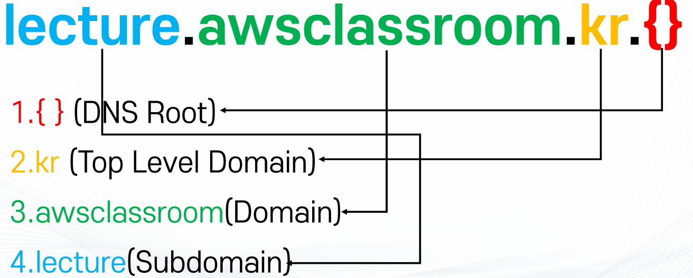

### DNS
#### 주요 개념
- DNS(Domain Name System) : 사람이 읽을 수 있는 문자열과 Internet 프로토콜 기반 정보를 매칭시켜주는 시스템
  - Internet Corporation for Assigned and Numbers (ICANN)에서 관리
- 도메인(Domain) : 대상의 IP주소 등의 정보와 맵핑되는 사람이 알아볼 수 있는 문자열
  - 서브도메인 : 도메인 중 문자열 앞에 추가 문자열이 붇는 도메인
    - 예) text.example.com
  - APEX 도메인(Zone Apex, Root Domain ...) : 도메인 중 앞에 추가 문자열이 없는 순수한 최상위 도메인
    - 예) example.com
- 레코드(DNS Record) : 도메인이 어떤 방식으로 데이터와 매칭되는지 정의하는 기록
  - 다양한 레코드 종류가 있으며 각 각 다른 정보와 매칭
  - 예: A레코드는 IPv4 주소, MX 레코드는 메일서버
- Domain Zone : 도메인의 정보를 담은 레코드의 집합
  - 예: www.awsclassroom.kr / lecture.awsclassroom.kr 등등
- Zone File : Domain Zone 정보를 저장한 텍스트 파일
- DNS Query : 주어진 도메인에 해당하는 정보를 요청하는 쿼리
- Name Server(NS) : DNS Query를 Zone File을 기반으로 응답할 수 있는 서버
  - Authoritative : DNS 정보의 원본을 가지고 있는 가장 최상위 NS 서버
  - None-Authoritative : Authoritative NS 서버를 조회하여 정보를 보관하고 있거나 응답하는 서버(캐시)
- DNS Resolver : 사용자와 NS 서버 사이에 위치한 서버로 실제 유저의 요청에 따라 IP주소 등의 정보를 확보하는 서버
  - 유저의 클라이언트가 제일 먼저 쿼리를 요청하는 대상이며 보통 ISP가 관리

#### 구성
- DNS는 계층 구조
  - 최상위 도메인부터 차례대로 계층 구조로 구성되어 있음(도메인의 개수가 많기 때문에 트레픽을 분산시킴)
  - 실제 레코드는 가장 마지막 계층에서 보관 및 처리

- DNS Root
  - DNS 계층 구조의 최상위 레벨
    - 즉 DNS Query 수행 시 최초로 조회하는 거점
    - 다음 단계인 TLDs(Top Level Domain)의 Zone File을 가진 NS 서버의 주소 정보 공유
  - IANA(Internet Assigned Numbers Authority)에서 조율하는 13개의 주체에서 관리
    - A~M까지 각 관리 주체별로 다른 서버 주소
  - Root Hints File
    - DNS Root의 주소를 담은 파일
    - 각 DNS Resolver에 하드코딩

- Top Level Domains(TLDs)
  - DNS 계층 구조의 두 번째 레벨
    - 실질적으로 정보를 가지고 있는 최상위 레벨
    - 예).com/.org/.net/.info 등등
  - 종류
    - Country Code TLDs : 각 나라에 할당된 두 자리 코드
      - 예).kr/.jp/.uk/.ai
    - Sponsored TLDs : 사설 조직이나 기관에 할당된 TLDs
      - 예).edu/.gov/.mil 등등
    - New Generic TLDs : 기타 다양한 TLDs
      - 예).app/.tech/.xyz/.blog
    - 관리 주체 : TLDs Registry (각 회사/나라 등)
      - 예).com/.net -> Versign, .org->Public Interest Registry, .kr->Korea Internet & Security Agency (KISA)
    - 실제 도메인의 레코드를 관리하는 NS서버의 주소 정보를 담은 Zone File 보유
  
- NS(Name Server)
  - 실제 도메인의 레코드를 가지고 있는 서버
    - 이 NS의 주소를 TLDs에 등록해두면 클라이언트에서 DNS 쿼리에 따라 해당 NS로 도착
  - 해당 도메인 및 서브도메인들이 어떤 프로토콜의 어떤 주소로 맵핑되는지(레코드)에 관한 Zone File보유
  - 여기서 최종으로 맵핑된 주소 확보

#### DNS를 통해 IP를 찾는 과정

1. 클라이언트(OS의 Stub Resolver)가 DNS Resolver(Recursive Resolver로 ISP나 Google DNS 같은 외부 DNS 서버)에 요청을 하면 DNS Resolver는 Hints File을 통해 DNS Root로 요청하면 DNS Root는 .kr(TLDs)에 대한 주소를 리턴한다.

2. DNS Root로부터 받은 정보를 통해 TLDs로 요청내면 TLDs에 저장된 NS의 정보를 리턴한다.

3. NS에서 Zone File에 등록된 정보를 통해 최종 도메인의 주소 정보를 리턴한다.

#### 도메인 등록

- 도메인 등록 대행(Domain Registrar)을 통해 등록
  - 도메인 등록 대행(Domain Registrar) : ICANN에게 인증받고 TLDs Registry와 협의하여 도메인 등록의 권한을 가진 주체
  - 예: 가비아, GoDaddy, Cafe24, AWS Route 53등
- 등록할 때 TLDs Registry에 자신이 원하는 NS 주소를 등록
  - 일종의 남은 슬롯에 자신의 NS를 예치하는 개념
  - NS는 자신의 개인 NS를 사용하거나, DNS Hosting Service 업체에서 대여 가능
  - DNS Hosting Service : DNS 기능을 제공하는 주체
    - 예 : 가비아, AWS Route53
    - 거의 대부분의 Registrar는 DNS Hosting Service를 같이 제공