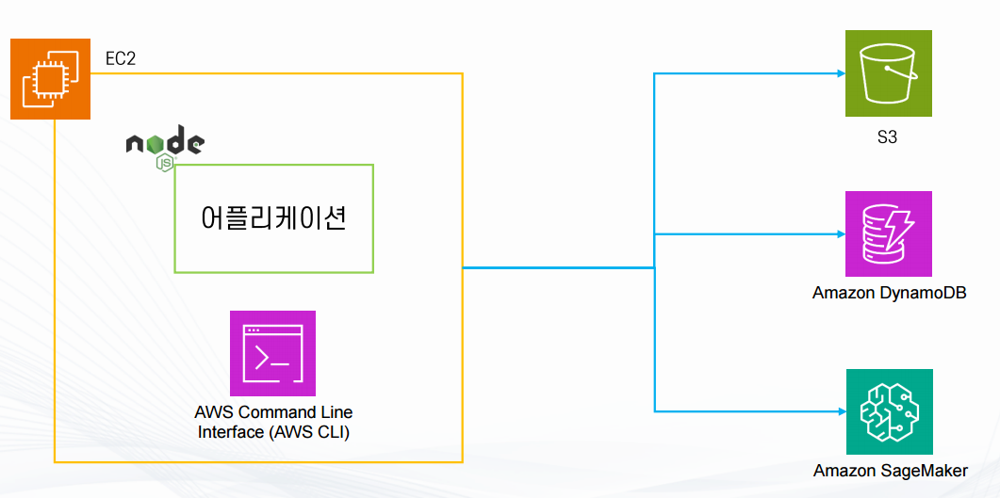
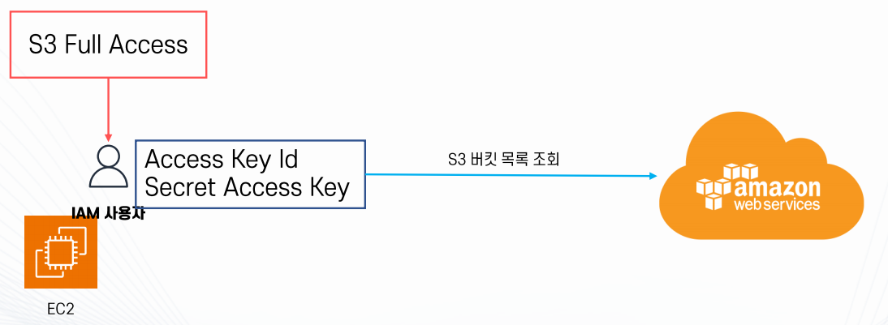
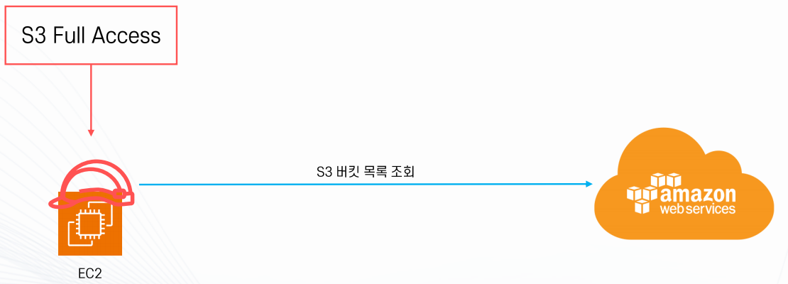
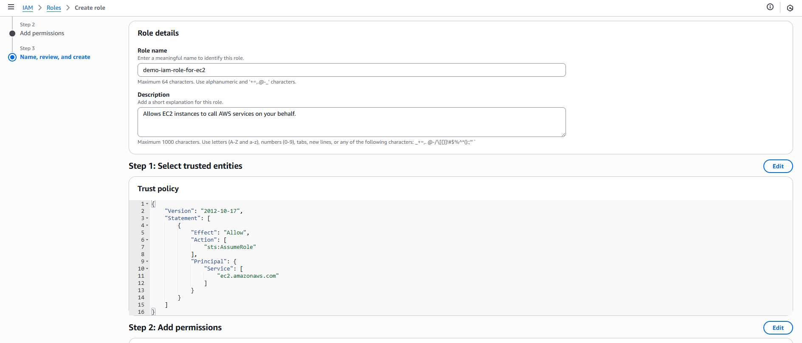
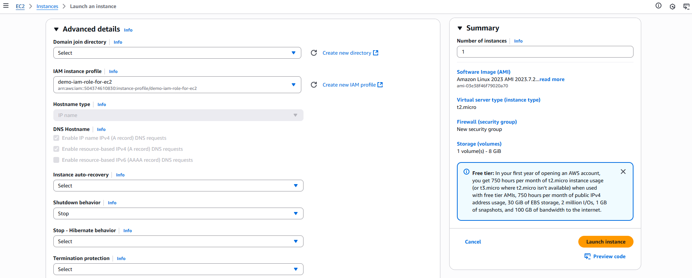

## EC2 권한



- IAM 자격 증명을 등록
    
  - IAM 사용자를 생성하고 IAM 자격증명을 발급받아 EC2에 등록
  - AWS Configure를 통해 자격 증명을 파일로 등록(~/.aws/credentials)
  - 관리가 어렵고 바꾸기 힘듦
    - 예: EC2 100대의 자격 증명을 교체해야 한다면?

- IAM 역할을 부여
    
  - 권한이 부여된 IAM 역할을 만들고 EC2에 부여
  - 관리가 쉽고 교체가 쉬움
  - 내부적으로 지속적으로 자격 증명을 변경
    - 뛰어난 보안성

- Demo
  - 역할 생성
    
  - EC2 인스턴스에 역할 적용
    
  - 결과
    ```bash
    # EC2 생성 시 IAMReadOnlyAccess 권한 부여 
    [ec2-user@ip-172-31-40-152 ~]$ sudo -s
    [root@ip-172-31-40-152 ec2-user]# aws iam list-users
    {
        "Users": [
            {
                "Path": "/",
                "UserName": "admin",
                "UserId": "AIDAXK3YRZOHKJEV5W6E7",
                "Arn": "arn:aws:iam::504374610830:user/admin",
                "CreateDate": "2025-06-13T05:23:44+00:00",
                "PasswordLastUsed": "2025-06-25T12:17:05+00:00"
            },
            {
                "Path": "/",
                "UserName": "demo-iam-user",
                "UserId": "AIDAXK3YRZOHOMROLAGKP",
                "Arn": "arn:aws:iam::504374610830:user/demo-iam-user",
                "CreateDate": "2025-06-16T03:55:22+00:00"
            }
        ]
    }
    # Role IAMReadOnlyAccess 제거
    [root@ip-172-31-40-152 ec2-user]# aws iam list-users

    An error occurred (AccessDenied) when calling the ListUsers operation: User: arn:aws:sts::504374610830:assumed-role/demo-iam-role-for-ec2/i-01316779e9879de2a is not authorized to perform: iam:ListUsers on resource: arn:aws:iam::504374610830:user/ because no identity-based policy allows the iam:ListUsers action
    ```
