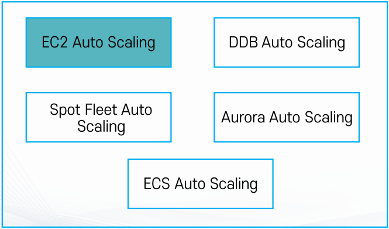

## 클라우드 환경의 EC2 활용 방식
- 수직 확장/Vertical Scale (Scale Up)
- 수평 확장/Horizontal Scale (Scale Out)
- 탄력성(Elastic) : 수요에 따라 컴퓨팅 파워/용량을 확장하거나 축소할 수 있는 능력
- 클라우드 환경에서 컴퓨팅 자원 활용
  - 온프레미스 환경에선 각 서버를 반영구적으로 사용
  - vs 클라우드 환경에서는 각 인스턴스는 소모품
    - 예고없이 장애가 발생하거나 통제된 방법으로 종료되는 것이 정상
      - 즉 **"언제나 인스턴스는 예고없이 종료된다"**라고 가정하고 아키텍처 설계 필요
    - 필요하면 더 가져다 쓰고 필요 없으면 버릴 수 있어야 함
  - 따라서 Stateless하며 고가용성의 확보 필요

## Auto Scaling

>💡 AWS Auto Scaling은 애플리케이션을 모니터링하고 용량을 자동으로 조정하여, 최대한 저렴한 비용으로 안정적이고 예측 가능한 성능을 유지합니다. AWS Auto Scaling을 사용하면 몇 분 만에 손쉽게 여러 서비스 전체에서 여러 리소스에 대해 애플리케이션 규모 조정을 설정할 수 있습니다.

### EC2 Auto Scaling의 목적
- 정확한 수의 EC2 인스턴스를 보유하도록 보장
  - 그룹의 최소 인스턴스 숫자 및 최대 인스턴스 숫자
    - 최소 숫자 이하로 내려가지 않도록 인스턴스 숫자를 유지(인스턴스 추가)
    - 최대 숫자 이상 늘어나지 않도록 인스턴스 숫자 유지(인스턴스 삭제)
- 다양한 스케일링 정책 적용
  - 다양한 스케일링 정책
    - 예: CPU의 부하에 따라 인스턴스 크기를 늘리기
    - 예: 특정 시간에 인스턴스 개수 늘리고 다른 시간에 줄이기
  - 가용 영역에 인스턴스가 골고루 분산 될 수 있도록 인스턴스를 분배

### EC2 Auto Scaling의 구성
- 시작 구성(launch configurations)/시작 템플릿: 무엇을 실행시킬 것인가?
  - EC2의 유형, 크기
  - AMI, 보안그룹, Key, IAM 역할
  - 유저 데이터(EC2 실행 시 실행할 자동 스크립트)
  - 기타 설정
- 모니터링: 언제 실행시킬 것인가?
  - 예:CPU 점유율이 일정 %을 넘어섰을 때 추가로 실행
  - 예:2개 이상이 필요한 스택에서 EC2 하나가 죽었을 때
  - CloudWatch(and/or) ELB와 연계
- 설정: 얼마나 어떻게 실행시킬 것인가?
  - 최대/최소/원하는 인스턴스 숫자
  - ELB와 연동 등
- 기타 설정 사항
  - 종료 정책: 인스턴스 숫자를 줄일 경우 어떤 순서로 인스턴스를 종료시킬지에 관한 정책
    - 기본
      - 인스턴스가 2개 이상인 가용영역의 인스턴스
      - 가장 오래된 시작 템플릿
      - 모두 같은 시작 템플릿이라면 다음 과금 시간에 가장 가까운 인스턴스 종료
    - 커스텀
      - 가장 예전 시작 템플릿부터
      - 가장 오래된 인스턴스부터
      - 가장 최근 인스턴스부터 등
  - Lambda를 활용해서 커스텀 정책 적용 가능

## ELB(Elastic Load Balancer)

>💡ELB는 둘 이상의 가용 영역에서 EC2 인스턴스, 컨테이너, IP 주소 등 여러 대상에 걸쳐 수신되는 트래픽을 자동으로 분산합니다. 등록된 대상의 상태를 모니터링하면서 상태가 양호한 대상으로만 트래픽을 라우팅합니다.

- 다수의 EC2에 트래픽을 분산 시켜주는 서비스
- 총 4가지 종류
  - Application Load Balancer
  - Network Load Balancer
  - Classic Load Balancer
  - Gateway Load Balancer
- Health Check: 직접 트래픽을 발생시켜 인스턴스가 살아있는지 체크
- Autoscaling과 연동 가능
- 지속적으로 IP주소가 바뀌며 IP 고정 불가능: 항상 도메인 기반으로 사용

### Application Load Balancer
- OSI Model Layer 7
- 트래픽을 모닡러이하여 라우팅 가능
  - 예: image.sample.com -> 이미지 서버로, web.sample.com -> 웹 서버로 트래픽 분산

### Network Load Balancer
- OSI Model Layer 4
- TCP, UDP 기반 빠른 트래픽 분산
- Elastic IP 할당 가능(IP 고정 가능)

### Classic Load Balancer
- 예전에 사용되던 타입으로 현재는 잘 사용하지 않음

### Gateway Load Balancer
- 먼저 트래픽을 체크하는 녀석
- OSI Layer 3
- 가상 어플라이언스 배포/확장 관리를 위한 서비스

### ELB + Auto Scaling
- Auto Scaling을 통해 EC2 인스턴스 숫자를 관리하고 ELB를 통해 분산 트래픽 처리
- Auto Scaling의 인스턴스 증감과 같이 ELB에 연결

## 대상 그룹(Tager Group)

- ELB가 라우팅 할 대상의 집합
- 구성
  - 대상 종류
    - Instance
    - IP
    - Lambda
    - ALB
  - 프로토콜(HTTP, HTTPS, gRPC, TCP 등)
  - 기타 설정
    - 트래픽 분산 알고리즘, 고정 세션 등

### 리스너
- ALB로 들어오는 요청을 처리하는 주체
  - 들어오는 트래픽의 프로토콜 + 포트 단위
- 규칙(Rule)으로 ALB에서 어떤 요청을 받을지, 요청을 어떻게 어디로 처리할지 결정
  - 예: http 8080 포트로 트래픽을 받아서 A 대상 그룹의 80번 포트로 배분
  - 예: https 프로토콜 443 포트로 트래픽을 받아 B 대상그룹의 80번 포트로 배분
- 규칙을 활용해 다양한 조건에 따라 트래픽 배분 가능
  - 활용 가능한 조건: Header, QueryString, source IP, Method 등
- 들어온 트래픽 처리 방식: forward, redirect, fixed-response, cognito 인증 등

### ALB 리스너와 규칙
- 리스너(Listner): 프로토콜과 포트를 기반으로 ALB로 들어오는 요청을 확인하는 주체
  - ALB 별로 최소 하나 이상의 리스터 필요
- 규칙(Rule): ALB가 요청을 분배하는 기준이 되는 규칙
  - 조건, 작업, 우선순위로 구성
- 조건(모두 만족 필요):
  - 호스트 헤더, 경로, HTTP Method, Source IP, HTTP Header, QueryString
- 작업 유형
  - 대상 그룹(최대 5개) 전달
    - 가중치(0~999)
  - URL Redirection(URI만, 전체 URL)
  - 고정 응답
- 규칙 순위(1~50,000)