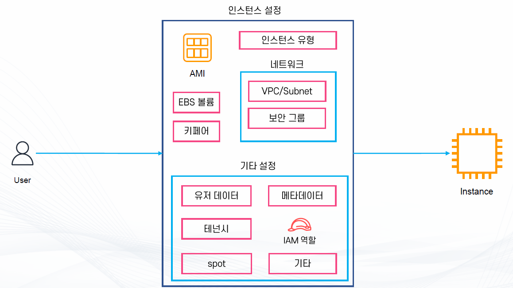
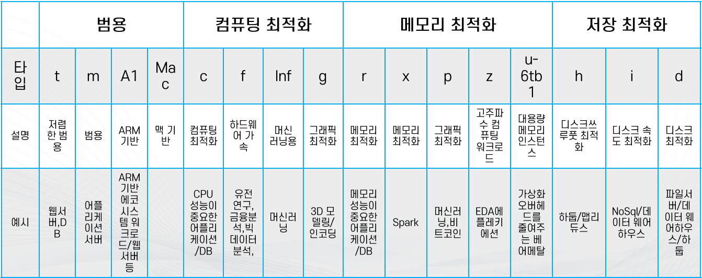
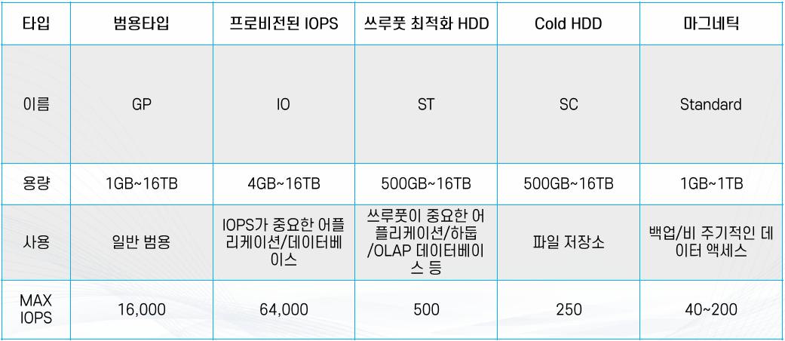
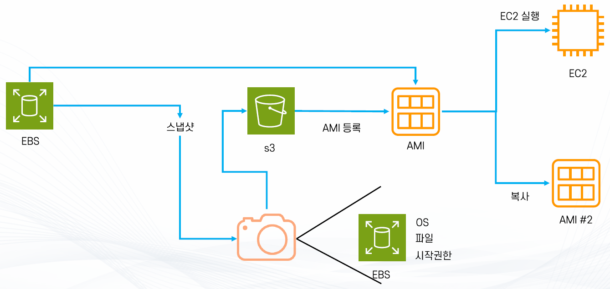

## EC2
> 💡Amazon Elastic Compute Cloud(EC2)는 안전하고 크기 조정이 가능한 컴퓨팅 파워를 클라우드에서 제공하는 웹 서비스로 개발자가 더 쉽게 웹 규모의 클라우드 컴퓨팅 작업을 할 수 있도록 설계되어 있다.

### EC2의 장점
- 초 단위 온디맨드 가격 모델
  - 온디맨드 모델에서는 가격이 초 단위로 결정
  - 서비스 요금을 미리 약정하거나 선입금이 필요 없음

- 빠른 구축 속도와 확장성
  - 몇 분이면 전 세계에 인스턴스 수백여대를 구축 가능

- 다양한 구성 방법 지원
  - 머신러닝, 웹서버, 게임서버, 이미지처리 등 다양한 용도에 최적화 된 서버 구성 가능
  - 다양한 과금 모델 사용 가능

- 여러 AWS 서비스와 연동
  - 오토스케일링, Elastic Load Balancer(ELB), CloudWatch

- Amazon EC2의 사용 사례
  - 데이터베이스, 웹 서버, 머신 러닝, 애플리케이션 백엔드 서버, 데이터 프로세싱, 기타 등

### EC2의 구조

### EC2 인스턴스란
- EC2에서 컴퓨팅을 담당
  - 다양한 유형의 크기로 구성
  - 저장을 담당하는 EBS와 네트워크로 연결

- 저장 방법에 따라 두 가지로 분류
  - EBS 연동
  - 인스턴스 스토어

- 하나의 가용영역(AZ)에 존재

### 인스턴스 유형
- 인스턴스의 역할에 따라 CPU, 메모리, 스토리지, 네트워크 등을 조합한 구성
- 각 인스턴스 유형 별로 사용 목적에 따라 최적화
  - 예) 메모리 위주, CPU 위주, 그래픽 위주 등등
- 유형 별로 이름 존재
  - 예) t유형, m유형, inf유형 등
  - 같은 유형의 인스턴스들을 인스턴스 패밀리라고 부름
- 타입 별 세대별로 숫자 부여
  - 예) m5 = m인스턴스의 5번째 세대
- 아키텍처 및 프로세스/추가 기술에 따라 접미사
  - c7gn = c 인스턴스 중 AWS Graviton 프로세서를 사용(g) + Network Optimized(n)

### 인스턴스 크기
- 같은 인스턴스 패밀리에서 다양한 크기가 존재
- 인스턴스의 CPU 갯수, 메모리 크기, 성능 등으로 크기 결정
- 크기가 클 수록
  - 더 많은 메모리
  - 더 많은 CPU
  - 더 많은 네트워크 대역폭
  - EBS와의 통신 가능한 대역폭

## EBS (Amazon Elastic Block Store)
> 💡AWS 클라우드의 Amazon EC2 인스턴스에 사용할 영구 블록 스토리지 볼륨을 제공한다. 각 Amazon EBS 볼륨은 가용 영역 내에 자동으로 복제되어 구성 요소 장애로부터 보호해주고, 고가용성 및 내구성을 제공한다.

- 가상 하드 드라이브
- EC2 인스턴스가 종료 되어도 계속 유지 가능, 별도의 생명 주기를 갖고 있음
  - 루트 볼륨으로 사용 시 EC2가 종료되면 같이 삭제됨
  - 단 설정을 통해 EBS만 따로 존속 가능
- 용량을 범위에 따라 자유롭게 설정 가능
- 특수하게 하나의 EBS를 여러 EC2 장착 가능한 경우도 있음(EBS Multi Attach)
- EC2 인스턴스와 같은 가용 영역에 존재
  - **즉 하나의 가용 영역 안에서만 존재**
- 가용 영역 안에 자동으로 분산 저장 : 99.999% 가용성 목표
- EBS 유형

  - 범용(General Purpose or GP) : SSD
  - 프로비저닝 된 IOPS(Provisioned IOPS or io) : SSD (속도)
  - 쓰루풋 최적화(Throughtput Optimized HDD or st) : HDD (용량)
  - 콜드 HDD (SC) : HDD
  - 마그네틱 (Standard) : HDD

### Snapshot
- 스냅샷 : EBS의 특정 시점을 저장한 이미지
  - 이후 EBS로 다시 복구 가능
  - EBS의 백업 용도로 활용 가능
- 증분식 : 바뀐 부분만 저장 가능
  - 즉 100GB 볼륨의 스냅샷을 5번 찍어도 500GB가 아닌 100GB + 4번의 변경 부분만 저장
  - 비용 역시 최적화
- S3에 저장 : 99.999999999% 내구성
- Data Lifecycle Manager / AWS Backup 등으로 자동화 해서 생성 가능
- 기타 여러 기능
  - 암호화
  - 아카이브 : 더 적은 비용으로 저장할 수 있으나 몇 가지 제약 사항 적용
    - 최소 90일 이상 저장
    - 복원에 최대 72시간 소요
  - 공유 : 다른 계정 등에 공유 가능
  - EBS Direct API를 활용해서 스냅샷에 직접 내용을 쓰거나 읽기 가능

## AMI(Amazon Machine Image)

### AMI란
- EC2 인스턴스를 실행하기 위해 필요한 정보를 모은 템플릿
- 구성
  - 1개 이상의 EBS 스냅샷
  - 사용 권한(어떤 AWS 어카운트가 사용할 수 있는지)
  - 블록 디바이스 맵핑(EC2 인스턴스를 위한 볼륨 정보 = EBS가 무슨 용량으로 몇 개 붙는지)
- 필요에 따라 Private으로 가지고 있거나 Public 공개 가능

### 인스턴스 저장 유형에 따른 AMI의 생성 방법
- EBS : 스냅샷을 기반으로 루트 디바이스 생성 (네트워크로 연결되어 있다.)
- 인스턴스 저장 : S3에 저장된 템플릿을 기반으로 생성

## 보안 그룹
- EC2의 방화벽 역할을 하는 서비스
- Port 허용
  - **기본적으로 모든 포트는 비활성화**
  - 선택적으로 트래픽이 지나갈 수 있는 Port와 Source를 설정 가능
  - Deny는 불가능
- 인스턴스 단위
  - 하나의 인스턴스에 하나 이상의 보안 그룹 설정 가능
  - 인스턴스에 여러 보안 그룹이 적용될 경우 모든 보안 그룹의 규칙을 적용 받음