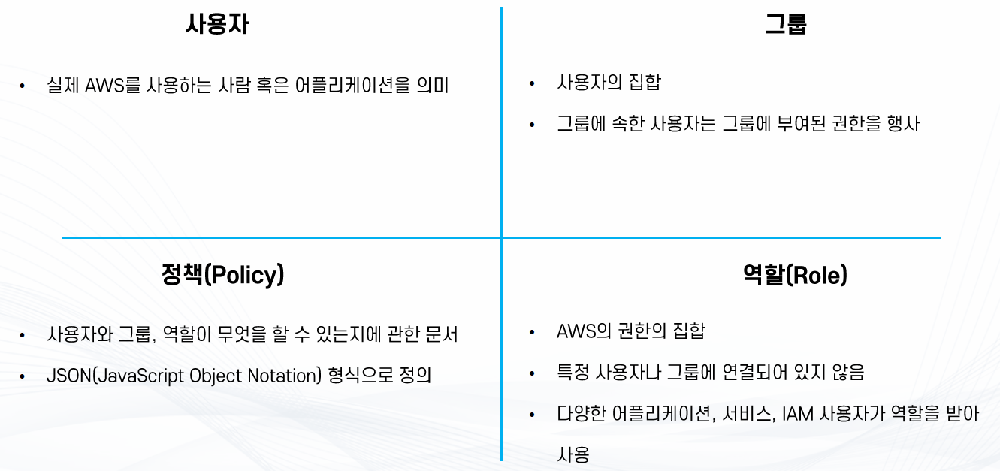

## IAM
> 💡AWS Identity and Access Management(IAM)를 사용하면 AWS 서비스와 리소스에 대한 액세스를 안전하게 관리할 수 있다. 또한 AWS 사용자 및 그룹을 만들고 관리하며 AWS 리소스에 대한 액세스를 허용 및 거부할 수 있다.

- AWS 리소스/사용자/서비스에 대한 안전한 접근 제어를 지원하는 서비스
- 리소스에 대한 인증 및 권한 부여 기능 보유
- 그 외 다양한 기능
  - 암호나 엑세스키를 공유하지 않고, AWS 계정 접근
  - 세분화 된 권한을 통해 API 별 권한 허용/거부
  - MFA(Multi-Factor Authentication)
  - SAML/OIDC 등을 통한 다양한 Identity Federation 기능
  - 사용자의 패스워드 정책 관리
- AWS 상에서 제로 트러스트를 구현하게 해주는 중요한 서비스

## IAM: User & Group
- 루트 계정: AWS 계정 생성 시 자동으로 만들어지며, 공유하거나 일상적으로 사용하지 않아야 합니다.
- 사용자 (User): 조직 내 사람을 의미하며, IAM을 통해 개별적으로 생성됩니다.
- 그룹 (Group)
  - 사용자들을 논리적으로 묶는 단위입니다.
  - 그룹은 사용자만 포함할 수 있고, 다른 그룹을 포함할 수 없습니다.
- 사용자와 그룹의 관계
  - 사용자는 그룹에 속하지 않아도 되고, 여러 그룹에 동시에 속할 수 있습니다.

## IAM: Permissions
- 사용자(User) 또는 그룹(Group) 에게 정책(Policy) 을 할당할 수 있습니다.
- 정책(Policy) 은 JSON 형식의 문서로, 사용자가 어떤 작업을 할 수 있는지 정의합니다.
- AWS에서는 최소 권한 원칙(Least Privilege Principle) 을 따릅니다. -> 사용자에게 **꼭 필요한 권한만 부여**해야 하며, 그 이상은 주지 않습니다.

## IAM: Policies Structure

- Version
  - 정책 언어의 버전을 지정합니다.
  - 보통 "2012-10-17"을 사용합니다.
- Id
  - 정책의 고유 식별자입니다.
  - 정책을 추적하거나 관리할 때 유용합니다.
- Statement
  - 정책의 핵심 부분으로, 하나 이상의 Statement 객체를 포함합니다.
  - 각 Statement는 특정 권한을 정의합니다.
    - Sid : Statement의 식별자로 정책 내에서 구분하기 쉽게 이름을 붙일 수 있습니다.
    - Effect : 정책의 효과를 지정합니다. **Allow** 또는 **Deny**
    - Principal : 이 정책이 적용되는 사용자, 역할, 계정을 지정합니다. 주로 신뢰 정책(trust policy)에서 사용됩니다.
    - Action : 허용하거나 거부할 **작업(액션)**을 지정합니다.
    - Resource : 작업이 적용되는 리소스를 지정합니다.
    - Condition : 정책이 적용되는 **조건**을 지정합니다.

## IAM: Password Policy
- 비밀번호 최소 길이 설정
  - 사용자가 설정할 수 있는 최소 비밀번호 길이를 지정합니다.
- 특정 문자 유형 요구
  - 다음과 같은 문자 유형을 포함하도록 요구할 수 있습니다.
    - 숫자, 소문자, 대문자, 특수문자
- IAM 사용자 비밀번호 변경 허용
  - 모든 IAM 사용자가 자신의 비밀번호를 직접 변경할 수 있도록 허용할 수 있습니다.
- 비밀번호 만료 설정
  - 일정 기간 후 비밀번호를 반드시 변경하도록 요구할 수 있습니다.
- 비밀번호 재사용 방지
  - 이전에 사용한 비밀번호를 다시 사용할 수 없도록 제한할 수 있습니다.

## IAM이란?
- AWS의 보안 및 관리를 담당하는 글로벌 서비스
- 주요 기능
  - AWS 어카운트 관리 및 리소스/사용자/서비스의 권한 제어
    - 임시 권한 부여
    - 서비스 사용을 위한 인증 정보 부여
  - 사용자의 생성, 관리, 계정의 보안
    - Multi-factor Authentication
    - 사용자의 패스워드 정책 관리
  - 다른 계정과의 리소스 공유
  - Identity Federation(Facebook 로그인, 구글 로그인 등)

## IAM 구성 요소

### Root 사용자
- 계정을 생성할 때 같이 생성되는 사용자
- 계정의 모든 권한을 가지고 있으며 계정 권한을 제한할 방법이 없음
  - 탈취 당했을 때 복구가 매우 어려움 = MFA 필수
- 자격증명 부여 가능
- Root 사용자만 가능한 작업
  - AWS 계정 설정 변경(매인 이메일 주소, 계정 이름, 연락처 정보 등)
  - 요금 관런 설정(IAM 유저에게 위임 가능)
  - AWS Support Plan(지원 플랜) 구독, 변경, 취소
  - AWS 계정 삭제

### IAM 사용자
- IAM(Identity and Access Management)를 통해 생성한 사용자
- 생성 시 권한이 따로 부여되어 있지 않으며 정책 혹은 그룹을 통해 권한을 부여받아 활동
- 자격 증명 부여 가능(Optional)
- 콘솔 로그인 가능(Optional)
- 사람 뿐만 아니라 애플리케이션 같은 다른 주체도 대표 가능
  - 예: 애플리케이션이 AWS 서비스를 사용하기 위해서 IAM 사용자의 자격 증명을 보관 후 사용

### 그룹
- IAM 사용자의 집합
- 그룹에 정책을 부여하여 그룹에 속한 모든 사용자에게 해당 정책에 따른 권한 부여 가능

### 역할(Role)
- AWS의 권한의 집합
- 역할에 맞는 다양한 권한의 집합을 만들고 IAM 사용자, AWS 서비스, 애플리케이션 등이 부여받아 활동

 ### 정책(Policy)
 - 사용자와 그룹, 역할이 무엇을 할 수 있는지에 관한 문서
 - JSON 형식으로 정의
 - 그룹, 역할, 유저 등에 부여되어 각 주체가 행동 가능한 권한을 정의
 - 구성
   - Resource : 어떤 AWS 리소스에 대해서
   - Action : 어떤 행동을
   - Effect : 허용/거부
   - Condition : 정책이 적용되는 조건(예: IP주소, 시간, 태그 등)
 - 사용자가 리소스를 사용할 수 있는 권한이 있는지 확인 이후 그룹에 권한이 있는지 확인한다.
 - A 서비스에서 B 서비스를 이용할 때에도 역할이 필요하다.

## AWS 이용 방법
- AWS 웹 콘솔
  - 웹 기반의 콘솔에 로그인하여 AWS를 사용
  - 콘솔 엑세스 자격 증명을 사용하여 인증
- 프로그래밍 엑세스 방식
  - Command Line Interface(CLI) : 명령줄 기반으로 AWS 서비스를 관리하는 통합 도구
  - Software Development Kit(SDK) : 다양한 프로그래밍 언어로 만들어진 AWS 서비스를 관리하는 패키지
    - 프로그래밍 언어에 맞는 SDK를 사용해 개발에 활용
  - 프로그램 방식 엑세스 자격 증명을 사용하여 인증

### 콘솔 엑세스 자격 증명
- 콘솔 로그인을 위해 필요
  - Root Email/Password : 루트 사용자 로그인을 위해 사용
  - IAM 사용자 이름/Password : IAM 사용자가 로그인 하기 위해 사용
  - Multi-Factor authentication(MFA) : 다른 자격 증명에 보안을 강화하기 위한 임시 비밀번호

### 프로그램 방식 엑세스 자격 증명
- AWS의 CLI 혹은 SDK를 사용할 때 필요한 자격 증명
- Access Key의 구성
  - Access Key ID : 유저 이름에 해당하는 키. 일반적으로 공개되어도 무방
  - Secret Access Key : 패스워드에 해당하는 키. 공개되면 안됨
- 하나의 IAM 사용자 당 2개의 Access Key Pair 발급 가능
- 활성화/비활성화 가능
- Secret Access Key의 경우 발급 시점 이외에 다시 확인이 불가능
- 생성한 IAM 사용자의 권한을 행사 가능
- IAM 사용자를 서버/프로그램 별로 생성하여 Access Key를 전달하여 CLI/SDK 사용
  - AWS CLI의 경우 서버의 별도 파일에 자격 증명을 저장하여 인증
  - AWS SDK의 경우 별도 파일에 자격 증명을 저장하거나 런타임에 자격 증명을 명시해서 인증
- 프로파일 : 자격증명의 단위로 서로 다른 자격증명에 이름을 부여해서 필요할 때마다 스위칭 가능