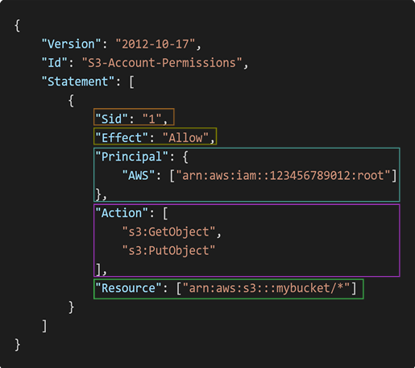

## IAM : User & Groups
- IAM :

## IAM 정책(Policy)의 구성 요소

- Version
  - 정책 언어의 버전을 지정합니다.
  - 보통 "2012-10-17"을 사용합니다.
- Id
  - 정책의 고유 식별자입니다.
  - 정책을 추적하거나 관리할 때 유용합니다.
- Statement
  - 정책의 핵심 부분으로, 하나 이상의 Statement 객체를 포함합니다.
  - 각 Statement는 특정 권한을 정의합니다.
    - Sid : Statement의 식별자로 정책 내에서 구분하기 쉽게 이름을 붙일 수 있습니다.
    - Effect : 정책의 효과를 지정합니다. **Allow** 또는 **Deny**
    - Principal : 이 정책이 적용되는 사용자, 역할, 계정을 지정합니다. 주로 신뢰 정책(trust policy)에서 사용됩니다.
    - Action : 허용하거나 거부할 **작업(액션)**을 지정합니다.
    - Resource : 작업이 적용되는 리소스를 지정합니다.
    - Condition : 정책이 적용되는 **조건**을 지정합니다.

## IAM Guidelines & Best Practices